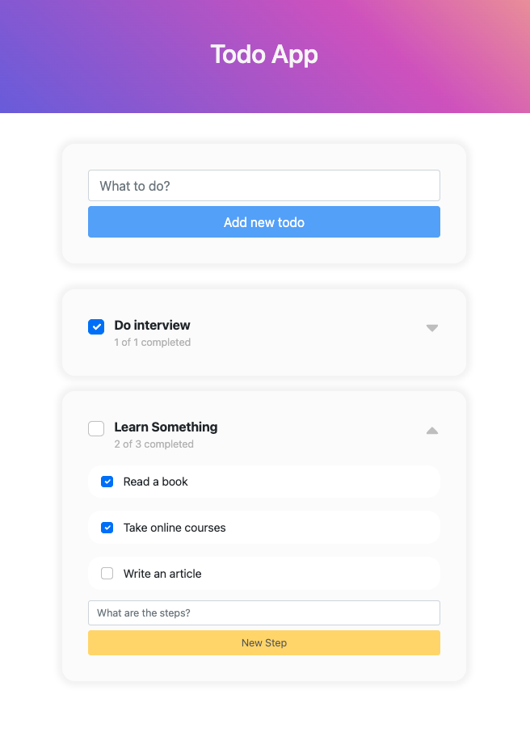

# Todo List
### Tech stackTech stack
- **Frontend** : NextJS , Bootstrap
- **Backend** : NestJS
- **Database** : Postgres with TypeORM

------------

### How to run on local
1. Start **Docker** on your desktop
1. Run `docker-compose up` at the root directory
1. Open browser and go to http://localhost:3000

API server is running on http://localhost:8000

------------

### How to run unit test
1. cd backend
1. npm run test:cov

------------
### Contact me
**Name** : Thanapong Somjai
**Email** : thanapongsj1996@gmail.com

